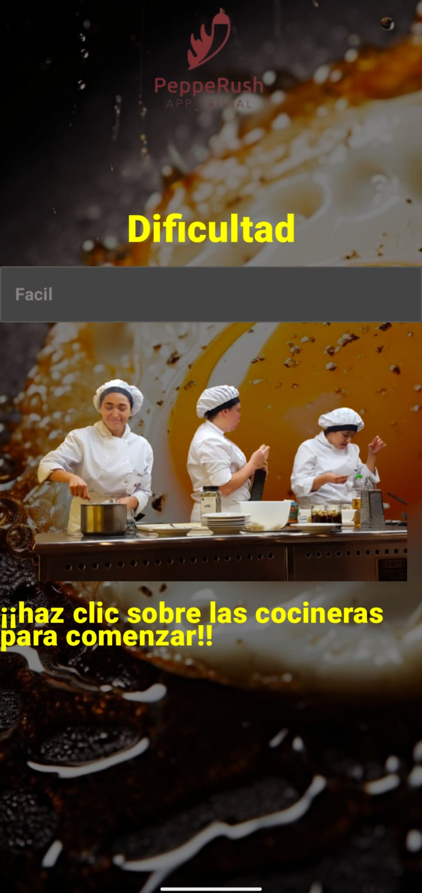
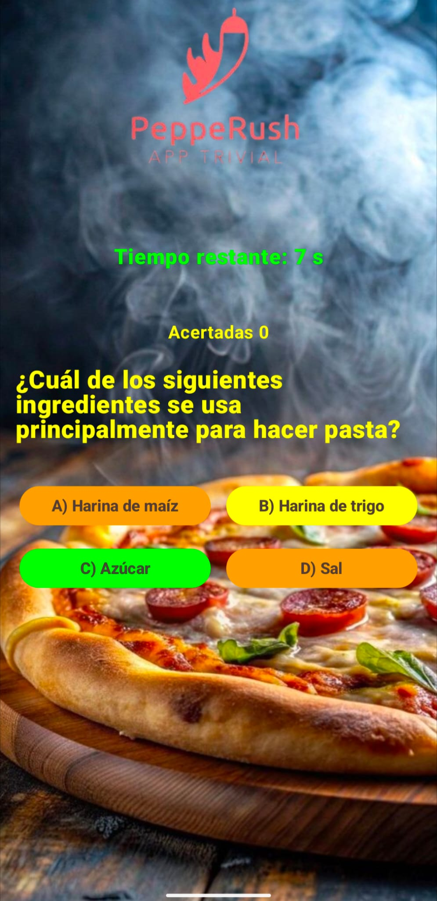
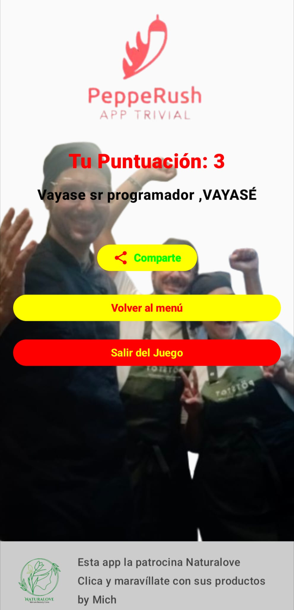

# PeppeRush - App Trivial Gastronómico 

**PeppeRush** es un juego interactivo de preguntas y respuestas (Trivia) centrado en la cultura gastronómica y el arte culinario. Este proyecto representa mi primera aplicación nativa desarrollada para el ecosistema Android, sirviendo como hito fundamental para asimilar el desarrollo de interfaces declarativas, la gestión estructurada de estados y la separación de responsabilidades.

---

##  Resumen del Proyecto

* **El Desafío**: Diseñar una mecánica de juego fluida que dependa de un temporizador regresivo estricto, manejando de forma segura los cambios de configuración del dispositivo sin perder el progreso ni la puntuación del usuario.
* **Propósito**: Implementar por primera vez una arquitectura limpia para comprender el flujo de datos unidireccional entre la lógica de negocio y la interfaz de usuario.

---

##  Características Principales

* **Selección de Dificultades**: Un componente de selección expone tres niveles de complejidad (Fácil, Media y Experto), condicionando de forma dinámica el banco de preguntas que se cargarán en la partida.
* **Sistema de Temporizador Reactivo**: Cada pregunta cuenta con un límite de tiempo de 10 segundos, obligando a una toma de decisiones rápida e incrementando la dinámica del juego.
* **Feedback Inmediato de Respuestas**: Al presionar una opción, la interfaz responde pintando de forma reactiva el resultado (Verde para aciertos, Naranja/Rojo para errores), mostrando adicionalmente en el margen inferior cuál era la opción correcta.
* **Finalización con Puntuación y Mensajes Dinámicos**: Al concluir la ronda de preguntas, se calcula el resultado final exponiendo una pantalla con métricas de aciertos y frases personalizadas según el desempeño del jugador.
* **Módulos de Integración Simulados**: Inclusión de lógica para compartir resultados y un banner inferior de patrocinio, emulando los requerimientos de un producto comercial real.

---

##  Arquitectura y Flujo de Datos

El desarrollo se construyó bajo el patrón arquitectónico **MVVM (Model-View-ViewModel)** aprovechando la reactividad nativa de **Jetpack Compose**:

* **View (Capa de Interfaz):** Construida de forma 100% declarativa. Utiliza `observeAsState()` para suscribirse a los flujos de `LiveData` expuestos por el **PreguntasViewModel**, transformándolos en estados nativos de Compose. Esto desencadena recomposiciones automáticas cada vez que el juego cambia (temporizador, puntuación o respuestas).
* **PreguntasViewModel & Lifecycle:** Actúa como el único cerebro lógico del juego. Gestiona de manera centralizada el temporizador y el banco de preguntas (inicializado a través de `PreguntasViewModelFactory`), garantizando que todo el estado de la partida permanezca intacto ante rotaciones de pantalla u otros eventos del ciclo de vida de Android.
##  Core Tecnológico

#### Android Stack
* 
* 
* 

#### Componentes de Arquitectura
* **State Management:** Gestión del estado de la UI reactiva de Compose vinculando los flujos de datos directamente al ciclo de vida de la vista.
* **Jetpack Lifecycle:** Uso de `ViewModel` para mantener el estado de la partida seguro ante cambios de configuración de la pantalla.

---

##  Demostración y Capturas de la Aplicación

  <h3> Vídeo Demostrativo de la App</h3>
https://github.com/user-attachments/assets/8da36415-c264-40f1-92ad-30eb04bb0c07
  
<em>Selección de dificultad, interfaz de juego con temporizador y pantalla final de puntuación.</em>

  ---

  <h3>📸 Capturas de Pantalla (Estructura Simétrica)</h3>

  

    
    
    
  

---

##  Autor

* **Michelle Carolina Posligua Contreras** (Desarrollo Android Nativo)
* **Institución**: Institut Tecnològic Barcelona (ITB)
